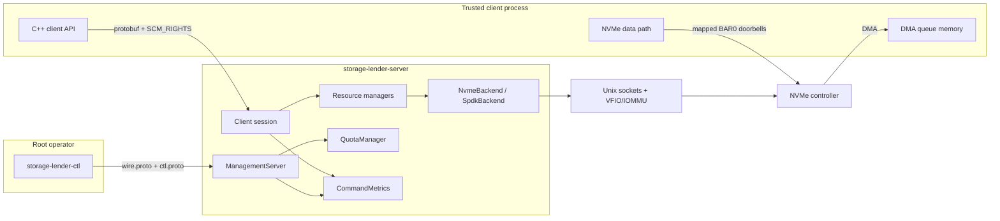
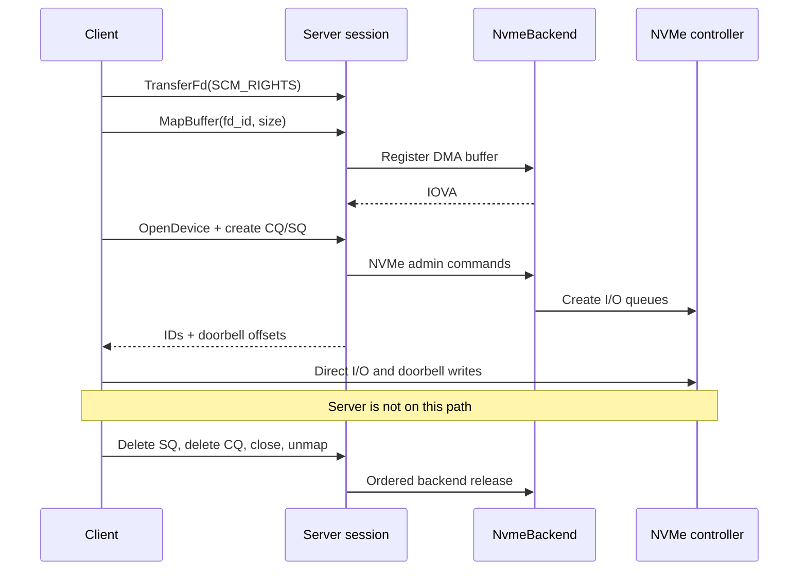

# Storage Lender Architecture

## Scope

Storage Lender lends DMA mappings and NVMe I/O queues over a Unix domain socket. The daemon owns
configuration, admission, SPDK/VFIO/IOMMU interaction, DMA registration, controller attachment, and
NVMe admin commands. After setup, the client owns queue memory, command construction, doorbell
writes, completion polling, and recovery of its direct I/O path.

- The daemon is not on the I/O hot path and cannot observe, meter, retry, or transparently recover
  direct client I/O.
- Socket admission is a broad trust boundary, not per-device authorization.
- Resources are session-scoped except for shared controller-open coordination and daemon-wide quota
  accounting.
- Cleanup and quota release occur only when backend release is proven.
- Hardware access remains explicit behind `NvmeBackend`.

This document is the normative architectural reference for shipped ownership, execution, protocol,
lifecycle, governance, endpoint, hardware, and test boundaries. Public integration details and
operator procedures remain in the related documents linked below.

## System Boundary

The Unix socket carries control-plane requests only. `GetDeviceInfo` returns a BAR0 resource path,
and queue creation returns doorbell offsets within that resource. The client maps BAR0 independently
and uses those offsets to bypass the daemon for submission and completion processing. The BAR0
mapping exposes more controller register space than the assigned doorbells, so an admitted client is
trusted with broad controller access. The client must quiesce direct I/O before it tears down queues
or memory that the controller can still use.

## Control and Data Flow

`TransferFd` and `MapBuffer` are distinct requests. `TransferFd` transfers exactly one descriptor in
one `SCM_RIGHTS` ancillary-data contract and returns a session-local `fd_id`; `MapBuffer` consumes
that identifier, registers the requested range for DMA, and returns its IOVA. No other request
accepts an ancillary descriptor.

The DMA mapping is also distinct from the client's BAR0 mapping. The server registers queue memory
through `NvmeBackend`; the client separately maps the path returned as
`DeviceInfo::pci_resource_path` and applies the CQ/SQ doorbell offsets returned by queue creation.
Neither the BAR0 mapping nor the resulting I/O passes through the client library's control socket.

## Process and Execution Model

Production startup constructs one Boost.Asio `io_context` and invokes `io_context::run()` once. The
server starts one stackful coroutine for the API accept loop and one for the management accept loop;
each loop starts a coroutine per accepted connection. Session coroutines can yield for socket I/O,
timers used by admin-command polling, and other asynchronous operations.

The accept loop is resilient to transient accept failures. It backs off briefly on descriptor or
memory exhaustion (`EMFILE`, `ENFILE`, `ENOBUFS`, `ENOMEM`), retries other transient errors
immediately, and stops only on an intended shutdown — the acceptor close reported as
`operation_aborted` or `bad_descriptor`. A transient accept failure no longer disables the listener.

`QuotaManager` acquisition, release, and policy replacement, and synchronous shared `DeviceManager`
mutations, do not yield between validation, accounting, and state mutation. Shared `DeviceManager`
and `QuotaManager` state, plus process-wide `CommandMetrics` mutation and snapshotting, therefore
rely on all production handlers running on that one event-loop thread; it is not made thread-safe by
mutexes or atomics. Adding multiple `io_context` runner threads requires first serializing affected
state with an Asio strand or redesigning it with explicit synchronization.

Queue administration is different. `QueueManager` CQ/SQ operations may yield through the
timer-backed sleep function while polling for an admin-command completion, allowing other sessions
to run. Each `QueueManager` is session-local, so its state remains isolated from those sessions.
Queue quota is reserved before creation enters backend polling and remains charged through deletion
polling.

`CommandMetrics` begins an observation after a valid request envelope is parsed and immediately
before API dispatch; it completes the observation after dispatch returns and before response
serialization or write. Handler work and coroutine yields inside dispatch are included. A
one-millisecond heartbeat samples event-loop lag only while at least one observation is active and
is rearmed from the actual sample time after a stall, so idle daemon and direct client I/O periods
create no metric timer wakeups.

The SIGHUP signal handler re-enters the event loop through `StorageLenderServer::request_reload()`.
A pending flag coalesces reload requests until the posted reload runs, so configuration replacement
is serialized with session work.

## Component Model

The process/session split is defined by [`StorageLenderServer`](../server/include/server.hpp).
Session-owned resource interfaces are [`BufferManager`](../server/include/buffer_manager.hpp) and
[`QueueManager`](../server/include/queue_manager.hpp). The separate
[`ManagementServer`](../server/include/management_server.hpp) adapts read-only quota and command
latency snapshots to the ctl protocol. Shared coordination, governance, and diagnostics are
implemented by [`DeviceManager`](../server/include/device_manager.hpp),
[`QuotaManager`](../server/include/quota_manager.hpp), and
[`PrincipalResolver`](../server/include/principal_resolver.hpp), with process-wide command timing in
[`CommandMetrics`](../server/include/command_metrics.hpp). Endpoint and hardware boundaries are
defined by [`UnixSocketEndpoint`](../server/include/unix_socket_endpoint.hpp) and
[`NvmeBackend`](../server/include/nvme_backend.hpp).

| Component             | Ownership            | Responsibility                                                                                                                             |
| --------------------- | -------------------- | ------------------------------------------------------------------------------------------------------------------------------------------ |
| `StorageLenderServer` | Process-wide         | Accept, frame, dispatch, reload, shutdown, and session cleanup                                                                             |
| `ManagementServer`    | Process-wide         | One-request ctl connections, peer-credential audit, and read-only snapshot responses                                                       |
| `CommandMetrics`      | Process-wide         | Fixed-window API latency, error, concurrency, completion-time, and active event-loop-lag observations                                      |
| `ClientSession`       | One connection       | Peer identity, sticky principal, socket, device handles, buffers, queues, and session lease                                                |
| `BufferManager`       | One session          | Received descriptors, DMA mappings, and buffer quota leases                                                                                |
| `QueueManager`        | One session          | CQ/SQ IDs, relationships, admin operations, and queue leases                                                                               |
| `DeviceManager`       | Shared               | Canonical PCI BDF identity, attach-time device-policy resolution, controller attachment, and shared/exclusive coordination across sessions |
| `QuotaManager`        | Shared               | Principal/global limits, leases, active usage, orphan usage, and policy generation                                                         |
| `PrincipalResolver`   | Shared configuration | UID-first, effective-primary-GID-second, default fallback mapping                                                                          |
| `UnixSocketEndpoint`  | Process-wide         | Secure endpoint creation, verification, listening, and guarded cleanup                                                                     |
| `NvmeBackend`         | Process-wide seam    | Hardware-facing DMA, controller, metadata, and queue operations, including explicit attach-time connection options                         |
| `SpdkBackend`         | Production backend   | SPDK implementation that applies the requested queue count at attach and retains the admin timeout per attached controller                 |

### Device identity and attach-time policy

`ConfigLoader` produces a complete `DevicePolicy`: built-in attach defaults overlaid by optional
`[devices.default]` values, plus fully inherited overrides keyed by canonical PCI BDF. Accepted BDFs
are case-insensitive `bb:dd.f`, with domain `0000` implied, or `dddd:bb:dd.f`; the canonical
identity is lowercase and domain-qualified. Configuration rejects different keys that resolve to the
same canonical BDF.

`DeviceManager` canonicalizes each `OpenDevice` address before policy lookup, shared/exclusive
coordination, and controller bookkeeping. On the first open, it passes the resolved
`NvmeConnectOptions` through `NvmeBackend`; equivalent BDF spellings therefore select one policy and
cannot create duplicate controller identities. Subsequent shared opens reuse that attachment.

`SpdkBackend` supplies the configured `num_io_queues` to SPDK before attach; the controller may
negotiate fewer, and controller metadata reports the effective value. After a successful attach, the
backend stores the configured admin-command timeout by controller pointer and supplies it to each
create or delete CQ/SQ command. A successful detach removes the stored timeout; a failed detach
retains it with the still-managed controller so cleanup can be retried.

## Protocol and Client Boundary

Each request and response is a four-byte little-endian length followed by a serialized protobuf
message. The maximum protobuf frame is 64 KiB. The server and client reject larger frames.
`TransferFd` is the only exception to a frame-only exchange: after its request frame, it requires
exactly one file descriptor through `SCM_RIGHTS`. Missing, truncated, malformed, or multiple
descriptors are protocol errors and are not accepted as partial ownership transfers.

[`proto/wire.proto`](../proto/wire.proto) owns the envelope and gRPC-style status-code values, while
[`proto/client.proto`](../proto/client.proto) owns client method IDs and operation payloads. The
internal wire library owns the frame limit and header validation, and
[`server/include/protocol.hpp`](../server/include/protocol.hpp) maps server errors to wire statuses.
These definitions form one cross-layer contract with server framing and dispatch, the client
wrapper, tests, examples, and public documentation; a method or status change must keep all of them
aligned.

The public client headers expose typed C++ operations and do not expose protobuf or framing.
Successful calls write results into output parameters; all calls return
`storage_lender::ClientError`. The client translates supported server statuses to that public enum
and distinguishes local transport failures and frame send/receive failures as `IO_ERROR` from
malformed response or operation-payload protobuf encoding as `PROTOCOL_ERROR`. Its implementation
target remains C++17-compatible even though the server is C++23.

## Resource Ownership and Lifecycle

A successful connection owns one session lease and a sticky principal identity. Within that session,
received descriptors, DMA mappings, queue IDs and relationships, device-handle leases, and their
quota leases are not visible to another session. `DeviceManager` remains shared so device handles
can coordinate shared versus exclusive access to process-wide controller attachments. `QuotaManager`
is also shared so every session contributes to principal and daemon-wide accounting.

The client owns the lifetime safety of its direct path. A server-side handle does not prove that the
client has stopped issuing commands or ringing doorbells, and the daemon cannot quiesce that data
path on the client's behalf.

### Ordered teardown

The client must first stop command submission, drain or otherwise quiesce in-flight I/O, and unmap
its independent BAR0 view. Normal control-plane teardown then deletes SQs before CQs, closes device
handles, and unmaps DMA buffers. A CQ cannot be deleted while an SQ still references it, a device
cannot be closed while session queues remain on it, and a DMA mapping must remain live while any
queue or command can reference it.

On disconnect, the server applies the same dependency order without assuming that the client behaved
correctly: all SQs, then all CQs, then device handles, then mapped buffers and unused received
descriptors, then the socket and session lease. `BufferManager` unregisters mapped DMA before
closing its descriptor and closes unused transferred descriptors after mapped buffers.

### Failure semantics

Quota release follows proven backend release. If an explicit SQ deletion, CQ deletion, device close,
or buffer unmap fails, its manager retains the resource and lease so the client can retry; the
failed operation does not create quota capacity. Failures remain reported through the protocol
status contract.

An admin-command timeout is reported to the client as `DEADLINE_EXCEEDED`, distinct from the
`INTERNAL` status of a backend failure. The timeout does not reset or reconcile controller state,
which remains indeterminate because the command can still complete after the deadline; the queue's
quota lease is therefore retained under the same proven-release rule (see
[decision to retain charges for unproven cleanup](decisions/2026-07-16-retain-charges-for-unproven-cleanup.md)).

Disconnect cleanup cannot be retried by that client. When backend release or descriptor closure
cannot be proven, cleanup marks the lease as orphaned before discarding session-local bookkeeping.
Orphan usage remains charged at both its principal and global scopes and contributes to subsequent
admission decisions. Cleanup continues in dependency order so one failure does not suppress attempts
to release independent resources.

## Resource Governance

Quota governance limits control-plane resource growth; it does not meter IOPS, bandwidth, command
rate, or direct I/O. Both enforced and unlimited modes retain usage accounting. Enforced policy
checks each acquisition at both the resolved principal scope and daemon-wide global scope across
eight dimensions:

- sessions;
- transferred descriptors;
- mapped buffers;
- maximum size of one mapped buffer;
- total mapped bytes;
- device handles;
- completion queues; and
- submission queues.

Active and orphan usage both count against cumulative limits. The single-buffer size dimension is
checked per mapping rather than accumulated.

### Principal resolution

At admission, the server reads the peer PID, UID, and effective primary GID from `SO_PEERCRED`.
`PrincipalResolver` first matches UID, then effective primary GID, then the reserved `default`
principal. Supplementary groups can affect kernel socket admission but are not quota identity input.
The resolved principal is sticky for the session; reloaded mappings apply only to later connections.

### Acquisition and release

The server acquires a lease before committing each governed resource. A request is denied if
positive growth would exceed either applicable ceiling or overflow accounting. Successful backend
creation transfers the lease into the owning session manager. Successful backend deletion destroys
that lease and releases usage; failed explicit deletion retains it; unprovable disconnect cleanup
moves it from active to orphan usage.

Quota-denied RPCs return `RESOURCE_EXHAUSTED`. Session admission is checked before a client
coroutine exists, so a session-quota denial or accounting failure instead logs a diagnostic and
closes the accepted socket without an RPC response. The transport connection may already have
completed, so rejection can become visible only after `connect()`; no `RESOURCE_EXHAUSTED` status is
available for that session.

Lower ceilings do not revoke existing allocations. Such grandfathered use remains charged, and new
growth is denied until current active-plus-orphan usage fits the new policy. A named principal
cannot be removed while it has active or orphan usage.

### Configuration resolution

`ConfigLoader` begins with one complete built-in `ServerConfig`, then overlays each explicitly
configured TOML value after validating its type, range, and dotted schema path. Root tables, nested
tables, and fields are optional; an empty or comment-only document therefore resolves to the
built-in configuration. Unknown fields and explicit invalid values remain errors rather than
requests for fallback. Per-device fields inherit from the resolved device default, and
named-principal quota fields inherit from the resolved default-principal limits.

Built-in schema version is 1. Logging uses the build default. API and ctl socket defaults are the
endpoints documented below. Device defaults are 65534 I/O queues and a 10-second admin-command
timeout. Quota mode defaults to enforced, with the finite global and default-principal ceilings
documented in the canonical configuration; named principal mappings default to none. Whole-policy
unlimited mode must be explicit and rejects limit tables that would otherwise be ignored.

Strict file loading preserves the operating-system error category. At process startup only, `ENOENT`
selects the built-in object and emits a warning identifying the selected path. Permission errors,
other I/O failures, invalid TOML, and invalid configuration fail startup. The selected path is
retained so a file created later can supply a reload candidate.

### Configuration reload

SIGHUP uses strict file loading and validates a complete resolved candidate configuration. A missing
file is therefore a reload error, not a request to restore built-in defaults, and leaves the active
configuration unchanged. Before applying reloadable fields, `StorageLenderServer` compares the
candidate `[devices]` policy with the startup policy. Device options are fixed at controller attach,
so any difference rejects the complete reload as restart-only; an identical device policy permits
other fields to reload. Quota policy replacement, principal-resolver replacement, and process-wide
logging-level replacement run synchronously on the event loop, making the update observationally
atomic: no session coroutine can observe a partial replacement. Invalid input, a logging level below
the binary's compiled floor, or an inapplicable quota policy leaves the previous configuration
active; successful replacement advances the policy generation. Coalescing permits at most one posted
reload while one is pending.

Logging is initialized at the build default so command-line and configuration-loading failures
remain visible, then the parsed runtime level is applied before SPDK and API endpoint startup. Debug
builds contain trace-and-higher statements; non-Debug builds contain debug-and-higher statements.
Runtime policy can filter compiled statements but cannot enable a lower level that is absent from
the binary.

Existing leases are grandfathered under a valid replacement, while subsequent growth uses the new
limits. Principal mappings affect new sessions only because admitted sessions keep their resolved
identity. The resolved API and ctl socket `path`, `owner`, `group`, and `mode` fields are
restart-only; changing any of them rejects the reload rather than partially applying the remaining
candidate.

## API Socket and Trust Boundary

The API endpoint requires an absolute pathname that ends in a non-empty socket filename, contains no
`.` or `..` components, and fits in `sockaddr_un::sun_path`, including its terminating null byte.
The configured mode must be `0600`, `0620`, `0640`, or `0660`. Account names are resolved at
startup. A non-root daemon may configure only its effective UID as owner and its effective or
supplementary GID as group; root may use any resolved owner and group.

Endpoint creation walks directory components without following symlinks. Each ancestor must be a
directory owned by root or the daemon's effective UID and must deny group and other writes; a
root-owned sticky directory is the only writable-ancestor exception. The immediate parent is
stricter: it must be owned by the daemon's effective UID and deny group and other writes. The target
must not already exist.

After binding under a restrictive umask, `UnixSocketEndpoint` records the socket's device and inode,
applies the configured owner, group, and mode, and verifies the type, complete metadata, and
recorded identity before listening. Cleanup unlinks only a socket with the recorded device and
inode, preserving a replacement pathname.

Filesystem access to this socket is broad admission to the API. The daemon reads peer credentials
for quota principal resolution, but has no application-level UID/GID allow-list and no per-device
ACL. Any admitted client can issue every API operation against every syntactically valid, supported
PCI BDF, subject only to resource existence, shared/exclusive coordination, and quota policy. Direct
BAR0 mapping further means this boundary is suitable only for trusted local clients, not
hostile-tenant isolation.

## Management Socket and Trust Boundary

The management endpoint uses the same secure pathname lifecycle as the API endpoint, but is a
distinct Unix stream socket and protocol. `[sockets.ctl]` is a field-level optional override;
omitted values resolve independently to `/run/storage-lender/ctl.sock`, owner and group `root`, and
mode `0600`. Filesystem ownership, mode, and parent directory permissions are the only management
authorization in this release. `SO_PEERCRED` pid, uid, and gid are captured for request auditability
and the future delegated-authorization seam, but do not add a second policy today.

`ManagementServer` reads and validates exactly one framed `wire::v1::Request`, dispatches one ctl
method, writes one response when possible, and closes the connection. `GET_QUOTA_STATE` and
`GET_COMMAND_LATENCY` both require an empty payload and take one synchronous snapshot on the
event-loop thread. A quota snapshot cannot observe a partially updated quota transaction. A command
latency snapshot contains the last 256 completed observations per known API method and one bounded
unknown-method bucket for the process lifetime. It includes non-OK responses in nearest-rank
duration percentiles, counts errors, and reports dispatch-start concurrency, completion times, and
active-only event-loop lag.

Command latency starts after request framing and valid protobuf-envelope parsing, immediately before
dispatch, and stops before response serialization and write. It therefore excludes socket backlog,
malformed envelopes, management calls, cleanup after the measured response, and direct NVMe I/O. The
snapshot is aggregate only: it carries no client, session, peer, BDF, queue, buffer, IOVA,
descriptor, controller, or direct-I/O identity or state. Neither management method calls SPDK or
touches a session resource manager.

`wire.proto` owns the shared envelope, gRPC-style statuses, and 64 KiB frame boundary.
`client.proto` and `ctl.proto` retain distinct method IDs and payloads; the public C++ client
library does not expose ctl messages or authorization.

## Hardware Boundary

`NvmeBackend` is the process-wide seam for DMA registration and unregistration, controller attach
and detach with explicit connection options, controller metadata, and NVMe queue admin operations.
`SpdkBackend` is the production implementation and contains the SPDK/VFIO/NVMe-facing behavior,
including the requested queue-count application and per-controller admin-timeout lifetime. Managers
and server handlers depend on the interface rather than calling SPDK directly, preserving
mock-driven testing of normal lifecycle, error, and cleanup paths.

Queue IDs, queue relationships, queue-memory IOVAs, and BAR0 doorbell offsets are hardware-visible
contracts. Changes to `SpdkBackend` queue semantics or offset calculation therefore require
hardware-aware review. Hardware tests are separate and may run only against an NVMe controller
deliberately provisioned with the required VFIO and hugepage environment; absence of that
environment is not a reason to weaken the mock-tested contract.

## Build and Test Architecture

The `StorageLender::Server::Core` target contains the server implementation without `main.cpp`. The
production `storage-lender-server` executable and server tests both link that target, so tests
exercise the same implementation units as the daemon.

The test-only `StorageLender::Server::TestSupport` target owns the `MockNvmeBackend`, raw protocol
client, server harness, and DMA-buffer helpers. Server tests are split into unit, integration, and
explicitly provisioned hardware layers. Public client API integration tests remain under `client/`
and link the installed-shape client interface with server test support rather than becoming server
protocol tests.

CTest component labels (`server` and `client`) are orthogonal to layer labels (`unit`,
`integration`, and `hardware`). A test carries one component and one layer label, allowing either
boundary to select the relevant suite without encoding ownership in directory-wide test logic.

## Related Documentation

- [Repository overview and operations](../README.md)
- [Architectural decisions](decisions/README.md)
- [Client integration contract](external/CLIENT_INTEGRATION.md)
- [Canonical runtime configuration](../config/storage-lender.toml)
- [Compliance guidance](../compliance/README.md)
